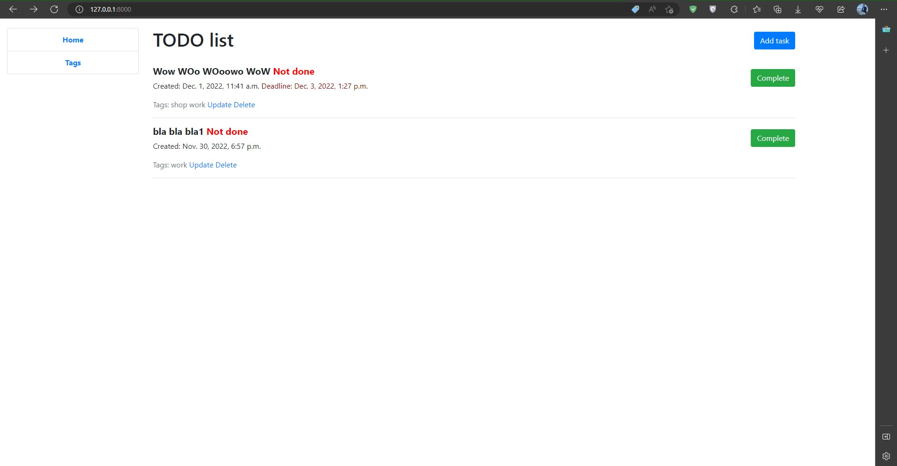
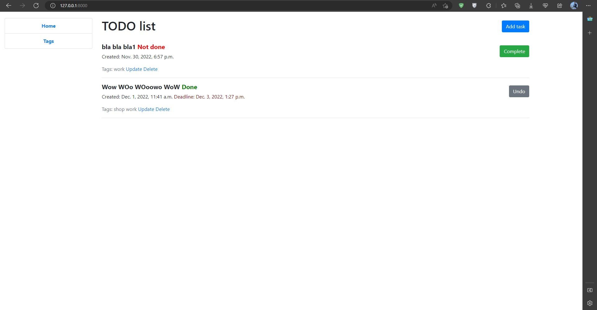
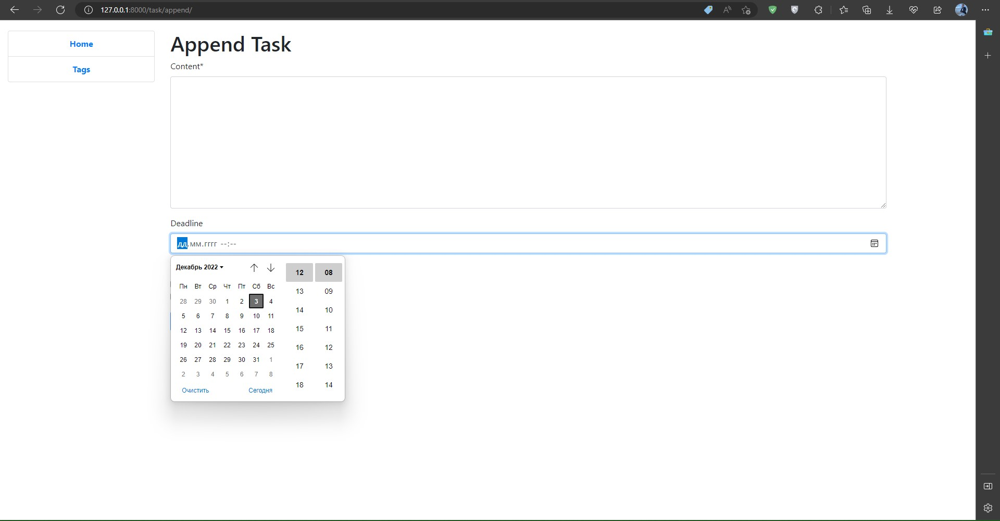
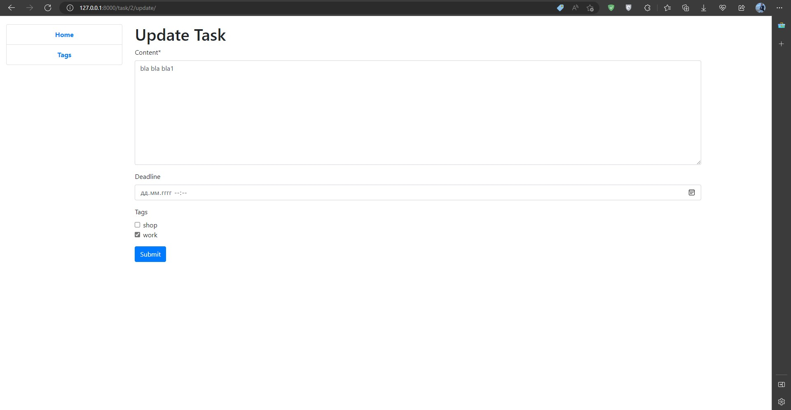
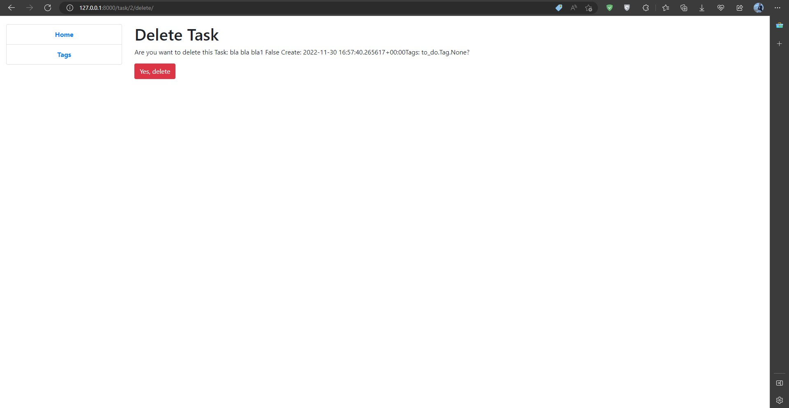
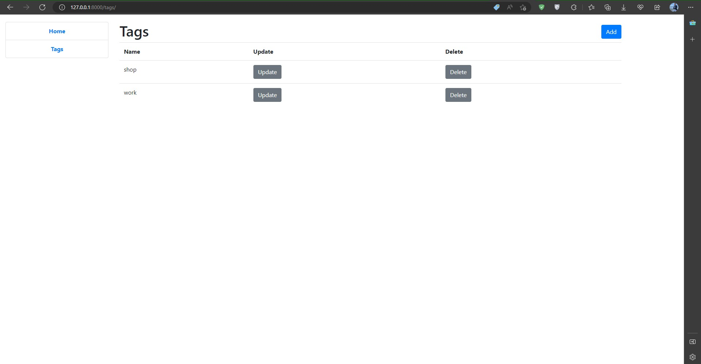
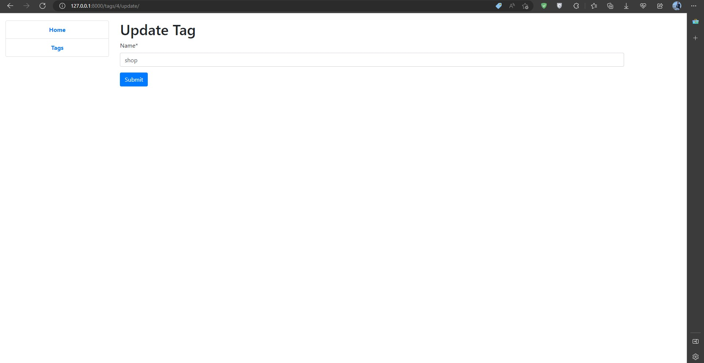
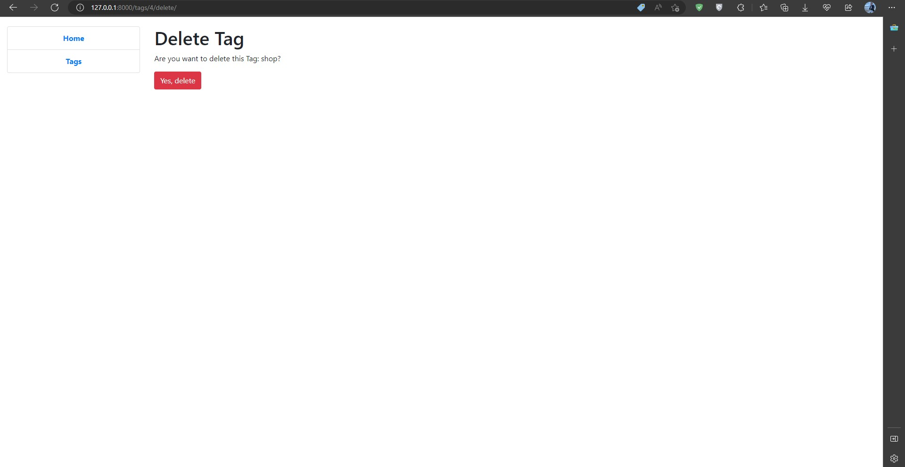
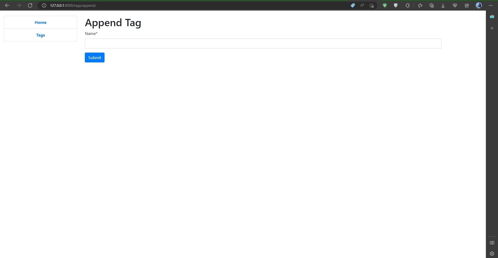

# TODO List

Django project for managing tasks

## Demo



















## Features

* Managing tasks directly from website interface

## Installation

Python3 must be already installed

```shell
git clone https://github.com/Glasis9/todo_list.git
cd todo_list
python3 -m venv venv
source venv/bin/activate
pip install -r requirements.txt
python manage.py runserver  # starts Django Sever
```
